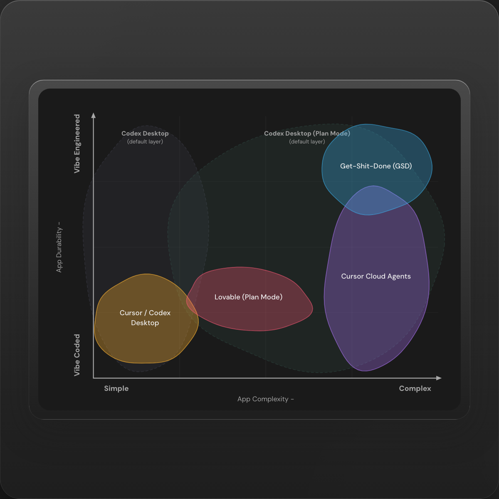

# my-tooling-opinions

[](https://openlinks.us/)

A Bun-powered SolidJS + Kobalte static site version of the original `ai-tooling-chart-interactive.html`.

## Preview



## Local development

1. Install dependencies:

```bash
bun install
```

2. Start the dev server:

```bash
bun run dev
```

3. Build the production site:

```bash
bun run build
```

4. Run the test suite:

```bash
bun run test
```

5. Regenerate the committed square graph screenshot:

```bash
bun run capture:graph
```

This writes the tracked asset to `public/graph-square.png`.

## GitHub Pages

This repo is configured for a GitHub project page at `/my-tooling-opinions/`.

To enable deployment:

1. Open the repo settings in GitHub.
2. Go to **Pages**.
3. Set **Source** to **GitHub Actions**.

After that, every push to `main` will trigger the Pages workflow in [deploy.yml](./.github/workflows/deploy.yml).
That workflow also regenerates `public/graph-square.png` and commits it back to `main` when the rendered image changes.

## Find Me

- [OpenLinks](https://openlinks.us/)
